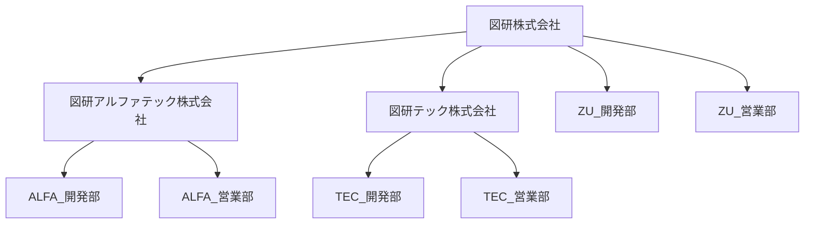
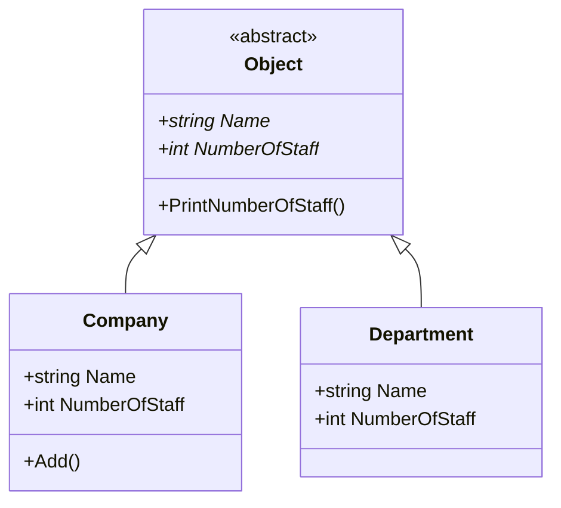

# Composite
Composite パターンとは木構造のデータを扱う際に便利なデザインパターン
- 木構造のオブジェクトを操作する際に、そのデータが木構造の「葉」の部分か、「枝」の部分かを意識せずに、単一のメソッドを呼び出すことで、「枝」「葉」各々の処理を実行できる。

## Composite パターンの仕組み
Composite パターンの説明のため、例のテーマは「会社」にする。
- 「会社」を「木構造」で表すと下図のようになる。


- クラス図は以下の通り

- サンプルは「図形株式会社」と「図形アルファテック株式会社」と「図形テック株式会社」のそれぞれに対して「PrintNumberOfStaff」メソッドを実行しているが、「子会社・部署」が存在する場合、再帰的に下層の「員数」(NumberOfStaff)を取得して合計を計算している。
 - 「Company」クラスも「Department」クラスも「Object」クラスを継承しているため、「NumberOfStaff」を実装していることが保証されている。

## Composite パターンのメリット
例えば、図研アルファテック会社に「検証課（員数：5）」を追加すると、「PrintNumberOfStaff」の出力結果は、以下のようになる。
```
【検証課追加前】
図研株式会社の員数 = 465名
図研アルファテック株式会社 = 35名
図研テック株式会社 = 180名

【検証課追加後】
図研株式会社の員数 = 470名
図研アルファテック株式会社 = 40名
図研テック株式会社 = 180名
```
- 員数の取得処理(NumberOfStaff)を変更しなくて、追加した部署の員数が加算される。

このように「木構造」を持つデータが追加されても、元の処理は全く変更せずに処理を行うことができる。

## Composite パターンのデメリット
- 抽象クラスは、自らの子孫である「枝」と「葉」クラスを同一視するために、共有のインターフェイスを作成するのは簡単のわけではない。
- 場合によっては、インターフェイス内の関数の数が非常に多くなる。


