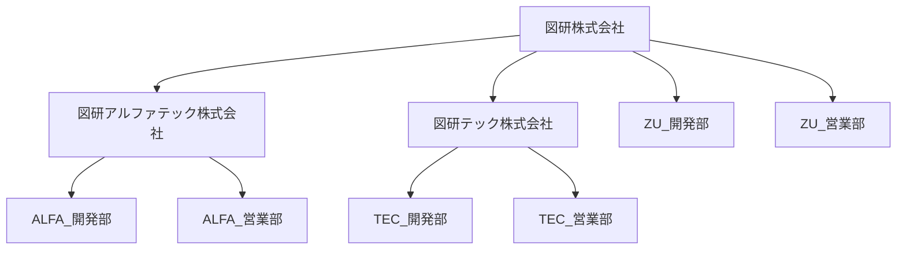

# Composite パターン
Composite パターンとは木構造のデータを扱う際に便利なデザインパターン
木構造のオブジェクトを操作する際に、そのデータが木構造の「葉」の部分か、「枝」の部分かを意識せずに、単一のメソッドを呼び出すことで、「枝」「葉」各々の処理を実行できる。

## Composite パターンの仕組み
Composite パターンの説明のため、例のテーマは「会社」にします。
「会社」を「木構造」で表すと下図のようになります。

「会社」と「部署」のそれぞれに対して「NumberOfStaff」メソッドを実行していますが、「子会社・部署」が存在する場合は再帰的に下層の「員数」を取得して合計を計算しています。
「Company」クラスも「Department」クラスも「Object」クラスを継承しているため、「NumberOfStaff」メソッドを実装していることが保証されています。

## Composite パターンのメリット
例えば、図研アルファテック会社に「検証課（員数：5）」を追加すると、
【検証課追加前】
図研株式会社の員数 = 465名
図研アルファテック株式会社 = 35名
図研テック株式会社 = 180名

【検証課追加後】
図研株式会社の員数 = 470名
図研アルファテック株式会社 = 40名
図研テック株式会社 = 180名

員数の取得処理(NumberOfStaff)を変更しなくて、追加した部署の員数が加算されます、
このように「木構造」を持つデータが追加されても、元の処理は全く変更せずに処理を行うことができます。