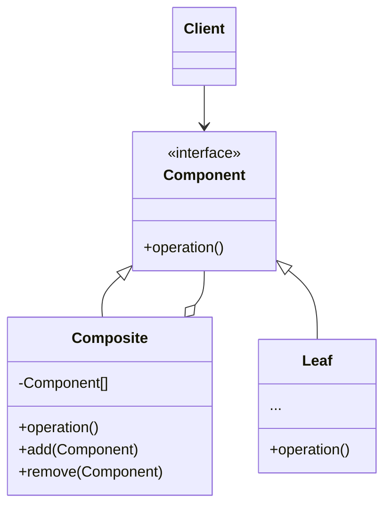
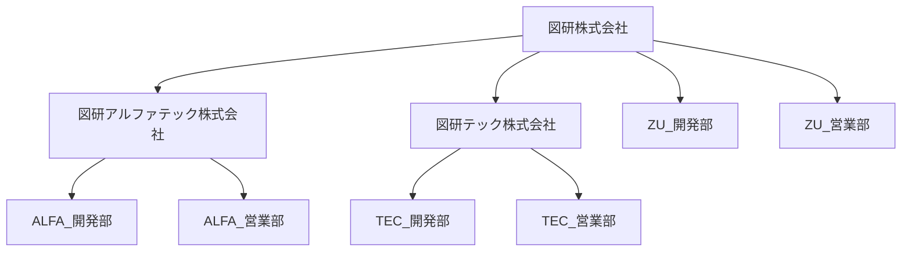
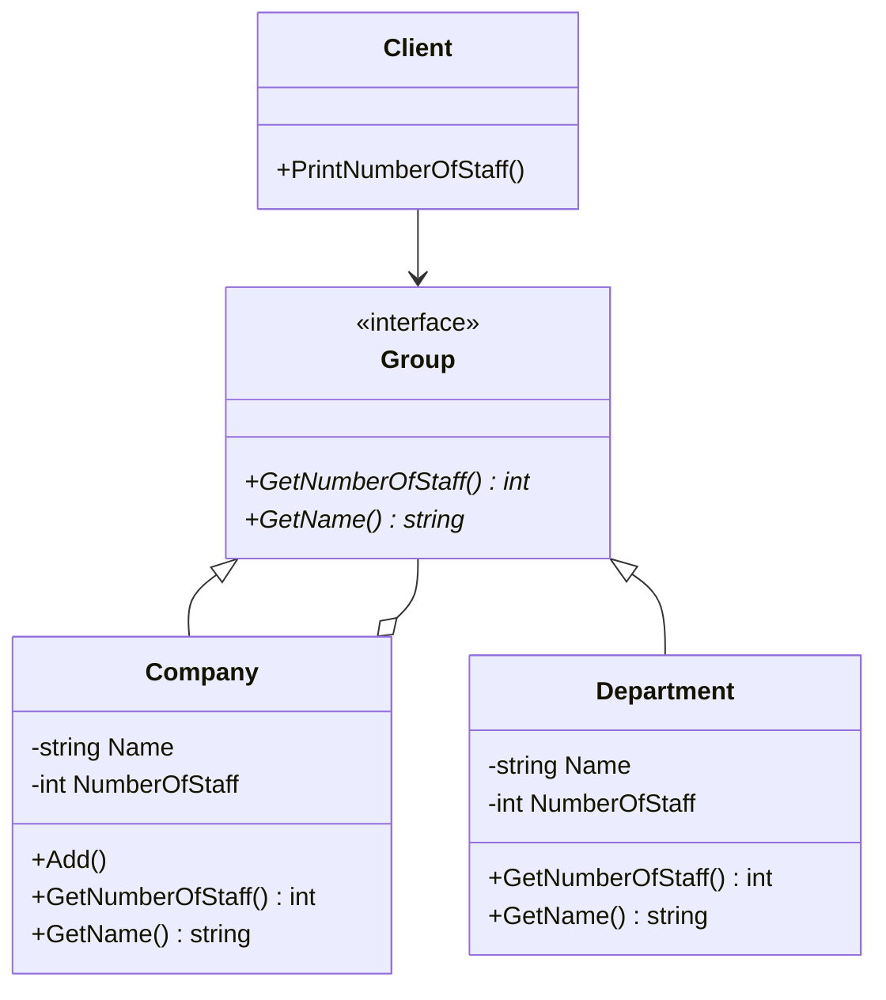

# Composite
Composite パターンとは木構造のデータを扱う際に便利なデザインパターン
- 木構造のオブジェクトを操作する際に、そのデータが木構造の「葉」の部分か、「枝」の部分かを意識せずに、単一のメソッドを呼び出すことで、「枝」「葉」各々の処理を実行できる。

## 構造
Composite パターンのクラス図は以下の通り


### Component
- メソッドの管理するため、木構造に共通のインターフェースを定義する。

### Leaf
- 葉にあたるクラス。
- 葉は基本要素で、 子要素を持たない。

### Composite
- 枝にあたるクラス。
- 枝は子要素(枝または葉)を持った。
- リクエストを受け取ると、 その作業を子要素に委任し、 中間結果を処理し、 最終結果をクライアントに返す。

### Client
- Component のインターフェースを通して、Composite と Leaf を操作する。

## 利用例
Composite パターンの説明のため、例のテーマは「会社」にする。
- 「会社」を「木構造」で表すと下図のようになる。


- クラス図は以下の通り

- サンプルは「図形株式会社」と「図形アルファテック株式会社」と「図形テック株式会社」のそれぞれに対して「PrintNumberOfStaff」メソッドを実行しているが、「子会社・部署」が存在する場合、再帰的に下層の「員数」(GetNumberOfStaff)を取得して合計を計算している。
 - 「Company」クラスも「Department」クラスも「Group」クラスを継承しているため、「GetNumberOfStaff」メソッドを実装していることが保証されている。

## メリット
  1. 「木構造」を持つデータが追加されても、元の処理は全く変更せずに処理を行うことができる。
 - 例えば、図研アルファテック会社に「検証課（員数：5）」を追加すると、「PrintNumberOfStaff」の出力結果は、以下のようになる。
```
【検証課追加前】
図研株式会社の員数 = 465名
図研アルファテック株式会社 = 35名
図研テック株式会社 = 180名

【検証課追加後】
図研株式会社の員数 = 470名
図研アルファテック株式会社 = 40名
図研テック株式会社 = 180名
```
 - 員数の取得処理(NumberOfStaff)を変更しなくて、追加した部署の員数が加算される。

  2. 枝と葉を同様に扱える。
 - 例のように、PrintNumberOfStaff()メソッドは会社か部署かを意識せずに、GetNumberOfStaff()を取得できる。
## デメリット
1. 抽象クラスは、自らの子孫である「枝」と「葉」クラスを同一視するために、共有のインターフェイスを作成するのは簡単のわけではない。
2. 「枝」と「葉」のメソッドを両方定義するため、「枝」「葉」それぞれに不要なメソッドが見える場合がある。
3. 場合によっては、インターフェイス内の関数の数が非常に多くなる。


